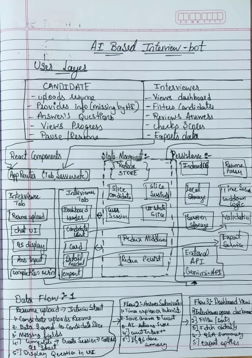

# AI-Powered Interview Assistant

This is an AI-powered interview assistant application with two main components:
1. Interviewee Dashboard - For candidates to take timed interviews
2. Interviewer Dashboard - For interviewers to view candidate results

## Tech Stack

### Frontend
- **React 19.1.1** with hooks and functional components
- **React Router v7.9.3** for client-side routing
- **Redux Toolkit** with **Redux Persist** for state management and data persistence
- **Tailwind CSS** for styling
- **Ant Design** for UI components
- **Framer Motion** for animations
- **React Query** for server state management
- **Vite** as the build tool


### AI/ML Services
- **Google Gemini API** for question generation and answer evaluation

### File Processing
- **pdf.js** for PDF parsing
- **mammoth.js** for DOCX parsing
- **Tesseract.js** for OCR capabilities

### Storage
- **Redux Persist** with localStorage for client-side data persistence
- **IndexedDB** via Dexie.js for more robust client-side storage
- **MongoDB** (optional) for server-side persistent storage

### Utilities
- **Axios** for HTTP requests
- **Day.js** for date/time handling
- **React Hot Toast** for notifications
- **Zod** for validation

### Development Tools
- **Vite** for fast development and building
- **Concurrently** for running frontend and backend simultaneously
- **ESLint** and **Prettier** for code quality

## Features

- Resume upload (PDF/DOCX) with automatic field extraction
- AI-generated interview questions based on resume
- Timed interview flow with pause/resume functionality
- Local data persistence so progress survives page refreshes
- Interviewer dashboard with candidate scoring and search/sort
- MongoDB integration for persistent data storage (optional)
- **Anti-copying measures to prevent cheating**
- **Tab synchronization for demo purposes**

## Implementation Status
This application fully implements all requirements specified in the assignment. For a detailed checklist of implemented features, see [IMPLEMENTATION_CHECKLIST.md](IMPLEMENTATION_CHECKLIST.md).

## Application Architecture




*Hand-drawn plan and flow of application architecture*

## How It Works

1. **Resume Upload**: Candidates upload their resume (PDF/DOCX)
2. **Information Extraction**: The system extracts name, email, and phone from the resume
3. **Dynamic Question Generation**: AI generates personalized interview questions based on the candidate's resume content
4. **Timed Interview**: Candidates answer questions with time limits based on difficulty
5. **AI Evaluation**: Answers are scored by AI and a summary is generated
6. **Results Dashboard**: Interviewers can view and compare candidate results

## Tab Synchronization

For this assignment, both the Interviewee and Interviewer interfaces are contained within the same application with tab navigation:

- **Interviewee Tab**: Simulates the candidate's experience with resume upload and interview flow
- **Interviewer Tab**: Simulates the recruiter's dashboard with candidate list and results

Both tabs share the same Redux store with persistence, ensuring that:
- When a candidate completes an interview in the Interviewee tab, the results immediately appear in the Interviewer tab
- Unfinished interviews can be resumed from either tab
- All data is persisted locally so progress survives page refreshes

For detailed information about how synchronization works, see [SYNCHRONIZATION.md](SYNCHRONIZATION.md)

## Security Measures

The application includes comprehensive anti-copying measures to maintain interview integrity:

- **Text Selection Prevention**: Questions cannot be selected or highlighted
- **Keyboard Shortcut Blocking**: Common copying shortcuts (Ctrl+C, etc.) are disabled
- **Context Menu Prevention**: Right-click is disabled on questions
- **Visual Indicators**: Lock icons show that content is protected
- **Developer Tools Detection**: Basic detection of debugging tools

For detailed information about security measures, see [SECURITY.md](SECURITY.md)

## Prerequisites

- Go 1.21+
- Node.js 16+
- MongoDB (optional, for persistent storage)
- Google Gemini API Key (for AI features)

## Setup

1. Clone the repository
2. Install Go dependencies:
   ```bash
   cd backend
   go mod tidy
   ```

3. Set up your MongoDB connection (optional):
   - Create a `.env` file in the `backend` directory
   - Add your MongoDB connection string:
     ```
     MONGODB_URI=mongodb://localhost:27017
     ```
   - If no MongoDB connection is provided, the application will use-in-memory storage

4. Set up your Google API Key:
   - Create a `.env` file in the root directory
   - Add your Google API key:
     ```
     VITE_GOOGLE_API_KEY=your_google_api_key_here
     ```

5. Install frontend dependencies:
   ```bash
   npm install
   ```

## Running the Application

### Option 1: Manual Start (Recommended for Development)

#### Start the Backend Server
```bash
cd backend
go run main.go
```

#### Start the Frontend Development Server
In a new terminal, from the root directory:
```bash
npm run dev
```

#### Access the Application
Open your browser to `http://localhost:3000`

### Option 2: Using Concurrently (Single Command)

Install concurrently globally:
```bash
npm install -g concurrently
```

Run both servers with one command:
```bash
concurrently "cd backend && go run main.go" "npm run dev"
```

For detailed information about all available run commands and options, see [RUN_COMMANDS.md](RUN_COMMANDS.md)

## Troubleshooting

### Common Issues

1. **Port Conflicts**:
   - If port 8081 is in use, change the PORT in backend/.env
   - If port 3000 is in use, modify the port in vite.config.js

2. **Dependency Issues**:
   - Run `go mod tidy` in the backend directory
   - Run `npm install` in the root directory

3. **Environment Variables Not Loading**:
   - Verify .env files are in the correct directories
   - Restart the servers after changing environment variables

4. **Frontend-Backend Connection Issues**:
   - Ensure both servers are running
   - Check that the backend API endpoints are accessible
   - Verify CORS configuration in the backend
   - For detailed troubleshooting, see [FRONTEND_BACKEND_TROUBLESHOOTING.md](FRONTEND_BACKEND_TROUBLESHOOTING.md)

### Go Dependencies

If you encounter issues with Go dependencies when running `go run main.go`, see the troubleshooting section in the README.

## API Endpoints

- `POST /api/upload-resume` - Upload and parse resume
- `GET /api/questions` - Get interview questions
- `POST /api/submit-answer` - Submit an answer
- `GET /api/candidates` - Get all candidates
- `GET /api/candidate/:id` - Get a specific candidate

## Data Models

### Candidate
```json
{
  "id": "string",
  "name": "string",
  "email": "string",
  "phone": "string",
  "score": "number",
  "summary": "string",
  "completedAt": "date",
  "answers": "array of Answer objects"
}
```

### Answer
```json
{
  "questionId": "number",
  "answer": "string",
  "timestamp": "string"
}
```

### Question
```json
{
  "id": "number",
  "text": "string",
  "difficulty": "string",
  "timeLimit": "number"
}
```

## MongoDB Integration

For detailed information about MongoDB integration, see [MONGODB_INTEGRATION.md](backend/MONGODB_INTEGRATION.md)

## Environment Configuration

For detailed information about environment variables, see [ENVIRONMENT.md](ENVIRONMENT.md)

## Testing

For detailed information about testing the application, see [TESTING.md](TESTING.md)
